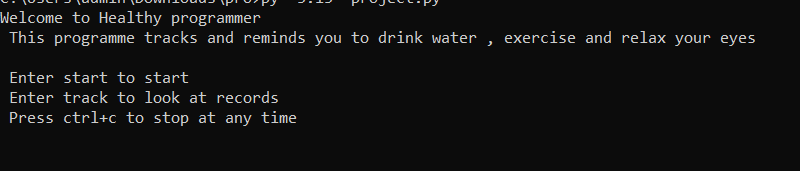
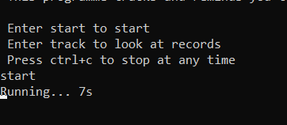
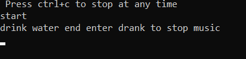
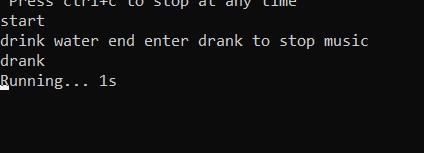

# Healthy Programmer

## Project Overview

Healthy Programmer is a Python-based console application that helps users maintain healthy habits while spending time on a computer.

The program provides reminders for drinking water, exercising, and resting the eyes. It also records completed activities in simple text log files so the user can check their activity history later.

The application uses time-based reminders and audio notifications. The user can start the reminder system or use the tracking option to view previous records.

## Features

- Start the Healthy Programmer reminder system.
- Remind the user to drink water.
- Remind the user to take a physical activity break.
- Remind the user to rest their eyes.
- Play audio alerts for reminders.
- Record completed water breaks in `wtr.txt`.
- Record completed exercise sessions in `ex.txt`.
- Record completed eye-rest sessions in `eye.txt`.
- View saved activity records using the tracking option.
- Stop the reminder process using `Ctrl+C`.

## Technologies / Tools Used

- Python 3.x
- `time` module
- `os` module
- `pygame` module
- MP3 audio files
- Text files for activity logs
- Command Line / Console

### Python Module Used

The project uses `pygame` for playing reminder sounds and Python's built-in `time` module for timing the reminders.

## Project Structure

```text
Healthy-Programmer/
├── Healthy programmer.py
├── time_to_drink_water.mp3
├── exercise.mp3
├── eyes.mp3
├── wtr.txt
├── ex.txt
├── eye.txt
└── README.md
```

The MP3 files are required for the audio reminders. The text files are used to store activity records.

REQUIREMENTS
- Python 3.x(must support pygame module)
- pygame


### 1. Install Python

Make sure Python 3.x is installed.

Check the installed version using:

```bash
python --version
```

or:

```bash
py --version
```

### 2. Install Pygame

Open Command Prompt or Terminal and run:

```bash
pip install pygame
```

If required, use:

```bash
py -m pip install pygame
```

### 3. Download the Project

Download or clone the GitHub repository and open the project folder.

```bash
git clone <YOUR_GITHUB_REPOSITORY_LINK>
```

Make sure the Python file, MP3 files, and log files are kept in the correct project folder.

## How to Run


1. Open Command Prompt (CMD).
2. Navigate to the project folder:
   cd Downloads
Or if the file is inside another folder:
   cd Downloads\YourFolderName
3. Run the program:
   py -3.13 "Healthy Programmer.py"

   OR

   py "Healthy Programmer.py"

```

## How to Use

### Start the Reminder System

Enter:

```text
start
```

The program will begin checking the reminder timers.

### Water Reminder

When the water reminder is triggered, the program plays the water reminder sound and asks the user to enter:

```text
drank
```

or:

```text
done
```

After the reminder is completed, the activity is recorded in `wtr.txt`.

### Exercise Reminder

When the exercise reminder is triggered, the program plays the exercise sound and asks the user to enter:

```text
done
```

After completion, the activity is recorded in `ex.txt`.

### Eye-Rest Reminder

When the eye-rest reminder is triggered, the program asks the user to start the eye-rest timer.

A countdown is then displayed. After the rest period is completed, the activity is recorded in `eye.txt`.

### Track Previous Records

From the main menu, enter:

```text
track
```

or:

```text
log
```

The program then provides options for:

```text
1) eyes
2) exercise
3) water
```

Enter the required activity to display its saved records.

## Reminder Intervals

The current submitted code checks the reminders using the following intervals:

- **Water:** 20 minutes
- **Exercise:** 60 minutes
- **Eye rest:** 20 minutes

The water interval is set to 10 seconds in the current code, which is useful for testing the program quickly.

## Testing

### Test 1 - Start Program

Run the Python file.

**Expected result:**  
The Healthy Programmer welcome message and available commands are displayed.

### Test 2 - Start Reminders

Enter:

```text
start
```

**Expected result:**  
The program starts displaying the running timer.

### Test 3 - Water Reminder

Wait for the water reminder interval.

**Expected result:**  
The water reminder sound starts and the program asks the user to enter `drank` or `done`.

### Test 4 - Record Water Activity

Enter:

```text
drank
```

**Expected result:**  
The sound stops and the completed water activity is saved in `wtr.txt`.

### Test 5 - Exercise Reminder

Wait for the exercise reminder interval.

**Expected result:**  
The program displays:

```text
Time to exercise
```

and plays the exercise reminder sound.

### Test 6 - Eye-Rest Reminder

Wait for the eye-rest reminder interval.

**Expected result:**  
The program displays a message asking the user to rest their eyes and starts the rest countdown.

### Test 7 - View Water Log

Enter:

```text
track
```

and then select:

```text
water
```

**Expected result:**  
The saved water activity records from `wtr.txt` are displayed.

### Test 8 - View Exercise Log

Select:

```text
exercise
```

**Expected result:**  
The saved exercise records from `ex.txt` are displayed.

### Test 9 - View Eye-Rest Log

Select:

```text
eyes
```

**Expected result:**  
The saved eye-rest records from `eye.txt` are displayed.

## Screenshots

### 1. Welcome Screen



### 2. Reminder System Running



### 3. Water Reminder



### 4. Water Reminder Completed



## Recommended GitHub Structure

```text
Healthy-Programmer/
├── Healthy Programmer.py
├── time_to_drink_water.mp3
├── exercise.mp3
├── eyes.mp3
├── wtr.txt
├── ex.txt
├── eye.txt
├── README.md
└── screenshots/
    ├── welcome.png
    ├── running.png
    ├── water-reminder.png
    └── water-completed.png
```

## Future Enhancements

- Allow the user to configure reminder intervals.
- Add a graphical user interface.
- Add a daily activity summary.
- Add a total water-intake counter.
- Add more types of healthy reminders.
- Add a settings menu.
- Store activity history in a database.
- Add notification controls.
- Add a daily goal and progress display.

## Author

Name: Shivanshu
Reg no.:26BAI10166

Project name: Healthy Programmer


